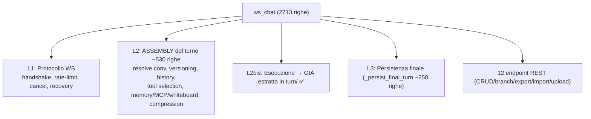

Ottimo, questo è il refactor giusto da affrontare. Prima di farti domande architetturali sensate, devo capire a fondo com'è fatto oggi il layer `turn/` e come chat.py lo usa, così valutiamo il percorso migliore senza tirare a indovinare. Leggo i file chiave.   

Read 

Read 

Read 

C'è già più di quanto pensassi: esiste un `AgentTurnExecutor` con feature flag `agent.enabled` e un bundle `AgentComponents`. Leggo gli executor e la parte agent per capire quanto è completo questo percorso.      

Searched for files matching `**/backend/services/agent/**`, 8 matches

Read , lines 1 to 200

Read , lines 1 to 200

Questo è molto più maturo del previsto: c'è un layer agentico completo (classifier, planner, critic, runner, degeneration). Esistono anche agent_loop_plan.md e ARCHITECTURE_PLAN.md. Li leggo insieme a come `ws_chat` invoca oggi l'executor, così capisco il piano già tracciato.     

Read , lines 1122 to 1500

Read , lines 1 to 200

Ora ho il quadro reale. Il layer `turn/` **non è** lavoro abbandonato a metà: è il piano v2 deliberato e ben documentato in agent_loop_plan.md. La mia valutazione precedente era imprecisa. Verifico l'ultimo tassello: `ws_chat` usa già `create_turn_executor` o c'è ancora il vecchio path a closure in parallelo?    

Searched for regex `create_turn_executor|TurnInput|TurnResult|\.execute\(|_stream_and_collect|WebSocketEventSink|run_tool_loop` (`**/backend/api/routes/chat.py`), 20 results

Read , lines 200 to 220

La migrazione è in realtà già avanzata: `ws_chat` costruisce `TurnInput`, chiama `create_turn_executor`, usa `WebSocketEventSink` e riceve `TurnResult`. Il vecchio path a closure è già stato rimosso. Quindi non c'è doppio path: il "destino" del layer `turn/` è chiaramente **tenerlo**. Leggo l'ultimo pezzo di `ws_chat` e lo stato del feature flag agent per chiudere il quadro prima delle domande.      

Read , lines 1685 to 1827

Searched for regex `class AgentConfig|class ClassifierConfig|enabled:|voice_mode_bypass` (`**/backend/core/config.py`), 20 results

Ho il quadro completo e accurato. Riassumo cosa ho trovato, poi ti faccio le domande che servono per decidere bene.

**Stato reale (corregge la mia analisi precedente):**
- Il layer `turn/` **non è** un refactor abbandonato a metà. È l'architettura voluta, documentata in agent_loop_plan.md v2, e **già cablata**: `ws_chat` costruisce `TurnInput` → `create_turn_executor()` → `DirectTurnExecutor` (delega a `run_tool_loop`) oppure `AgentTurnExecutor` (classifier→planner→critic). C'è **un solo path di esecuzione**. Il "destino" del layer è: **tenerlo e completarlo**.
- chat.py resta a 2713 righe non per l'esecuzione (già estratta), ma per: il **preambolo gigante di `ws_chat`** (~530 righe: resolve conversazione, save+versioning, attachments, history, selezione tool, context memory/MCP/whiteboard, compressione pre-gen, assembly `TurnInput`), `_persist_final_turn` (~250 righe), **12 endpoint REST**, e ~20 helper.
- Il layer agentico (classifier/planner/critic) esiste ma è **feature-flag OFF di default**.

Registro una nota di sessione e ti pongo le domande chiave.    

Created memory file 

Ora le domande. Ho strutturato 4 decisioni che determinano completamente l'approccio. 

Analyzing your answers...

Perfetto, ho le risposte. Sintesi delle tue scelte:
- **Scope C**: split + estrazione TurnAssembler + rework strategia agentica.
- **Strategia agent**: da valutare insieme → ti preparo un confronto dettagliato e decidiamo.
- **Struttura file**: scelgo io la soluzione più professionale/modulare/scalabile.
- **Test**: verifico io lo stato di partenza.

Comincio stabilendo la baseline dei test (rete di sicurezza per garantire zero regressioni), poi ti presento il confronto strategico e il piano. Eseguo la suite backend.    

Ran terminal command: cd backend; python -m pytest -q -p no:cacheprovider 2>&1 | Select-Object -Last 60
Completed with input: cd backend; python -m pytest -q -p no:cacheprovider 2>&1 | Select-Object -Last 60

Manca `qdrant_client` nell'ambiente. Verifico se è una dipendenza dichiarata e se il venv è quello giusto.    

Ran terminal command: cd ..; python -c "import sys; print(sys.executable)"; pip show qdrant-client 2>&1 | Select-Object -First 3; Select-String -Path backend\pyproject.toml -Pattern "qdrant" 

Il Python attivo è quello globale (Python313), non il .venv. Attivo il venv del progetto.     

Ran terminal command: & .\.venv\Scripts\Activate.ps1; python -c "import sys; print(sys.executable)"; python -c "import qdrant_client; print('qdrant ok')" 2>&1 | Select-Object -First 3
Completed with input: & .\.venv\Scripts\Activate.ps1; python -c "import sys; print(sys.executable)"; python -c "import qdrant_client; print('qdrant ok')" 2>&1 | Select-Object -First 3

Il .venv non ha le dipendenze installate (`qdrant-client` dichiarato ma assente). Per avere una baseline affidabile installo il backend in modalità editable con i dev extras. Potrebbe richiedere un po'.     

Ran terminal command: cd backend; uv pip install -e ".[dev]" 2>&1 | Select-Object -Last 25
Completed with input: cd backend; uv pip install -e ".[dev]" 2>&1 | Select-Object -Last 25

L'install ha aggiunto molti pacchetti ma è uscito con codice 1. Vedo l'errore completo.    

Ran terminal command: uv pip install -e ".[dev]" 2>&1 | Select-String -Pattern "error|fail|Could not|No solution|conflict|warning: |Resolved|Installed|Audited" | Select-Object -First 40
Completed with input: uv pip install -e ".[dev]" 2>&1 | Select-String -Pattern "error|fail|Could not|No solution|conflict|warning: |Resolved|Installed|Audited" | Select-Object -First 40

L'install ha risolto 113 pacchetti. Verifico se ora le import funzionano e provo a collezionare i test.     

Ran terminal command: python -c "import qdrant_client, fastembed, sqlite_vec; print('imports ok')" 2>&1 | Select-Object -First 5
Completed with input: python -c "import qdrant_client, fastembed, sqlite_vec; print('imports ok')" 2>&1 | Select-Object -First 5

`qdrant_client` ora c'è; manca `fastembed` (extra opzionale). Controllo gli extra in pyproject per installare quelli che servono ai test.     

Ran terminal command: Select-String -Path pyproject.toml -Pattern "optional-dependencies|^\[|fastembed|\.\[" ; Write-Output "---EXTRAS---"; python -c "import tomllib; d=tomllib.load(open('pyproject.toml','rb')); print(list(d['project'].get('optional-dependencies',{}).keys()))"

Ran terminal command: uv pip install -e ".[dev,memory]" 2>&1 | Select-Object -Last 8; Write-Output "---"; python -c "import qdrant_client, fastembed, sqlite_vec; print('imports ok')" 2>&1 | Select-Object -Last 3
Completed with input: uv pip install -e ".[dev,memory]" 2>&1 | Select-Object -Last 8; Write-Output "---"; python -c "import qdrant_client, fastembed, sqlite_vec; print('imports ok')" 2>&1 | Select-Object -Last 3

Ran terminal command: Select-String -Path pyproject.toml -Pattern "sqlite-vec|sqlite_vec"; uv pip install sqlite-vec 2>&1 | Select-Object -Last 4; python -c "import qdrant_client, fastembed, sqlite_vec; print('imports ok')" 2>&1 | Select-Object -Last 2

Tutte le import ok. Eseguo la suite completa per la baseline.     

Ran terminal command: python -m pytest -q -p no:cacheprovider 2>&1 | Select-Object -Last 40

I test girano in background. Intanto leggo i dettagli del layer agentico esistente per fondare il confronto strategico su ciò che hai già, invece che su astrazioni.       

Read 

Read , lines 1 to 160

Read , lines 130 to 235

Ho il quadro completo del layer agentico. Controllo se i test sono terminati.    

Checked terminal output

Read , lines 1 to 120

Questa è la scrollback vecchia; il pytest sta ancora girando. Continuo a fare polling.     

Checked terminal output

Read , lines 1 to 60

Il buffer continua a mostrare scrollback vecchia e il pytest è ancora in esecuzione (verrò notificato al termine). Non blocco la discussione su questo: la baseline è una rete di sicurezza per la fase di *implementazione*, mentre adesso dobbiamo decidere insieme la strategia. Ti presento il confronto e la mia proposta.

---

# Proposta di refactor + strategia agentica

## A. Cosa ho verificato (stato di fatto)

Il layer `turn/` è già l'architettura corretta e cablata. Il vero problema è che chat.py mescola **tre responsabilità** che il piano v2 voleva separare ma ha separato solo a metà:

L'esecuzione è già pulita. Ciò che resta dentro chat.py e va estratto è: **l'assembly del turno** (L2), la **persistenza** (L3), gli **endpoint REST** e gli **helper di contesto**.

## B. Struttura file che propongo (hai delegato a me)

Package `backend/api/routes/chat/` — la soluzione più modulare e senza debito, con __init__.py che ri-esporta `router` così **nessun import esterno cambia**:

| File | Responsabilità | Estratto da |
|---|---|---|
| __init__.py | aggrega e ri-esporta `router` | — |
| `ws.py` | solo `ws_chat`: protocollo, cancel, recovery, dispatch | L1 |
| `_assembly.py` | `TurnAssembler`: resolve conv, versioning, history, tool selection, context build → produce `TurnInput` | L2 |
| `_persist.py` | `_persist_final_turn`, `_build_done_event`, recovery | L3 |
| `_context.py` | `_build_mcp_context`, `_format_memory_context`, `_build_whiteboard_context`, `_compute_context_breakdown` | helper |
| `_versioning.py` | logica edit/branch/active_versions | helper |
| `conversations.py` | GET/DELETE/title/switch-version/branch/create | REST |
| `io.py` | export/import/file-path/upload + `_verify_magic_bytes` | REST |

Risultato: ogni file ~150–300 righe, `ws_chat` scende da ~700 a ~120 righe ed è leggibile.

Nota collaterale: ho scoperto che `sqlite-vec` **non è dichiarato** in `pyproject.toml` pur essendo importato (l'ho dovuto installare a mano per far partire i test). È un bug di dipendenza che ti segnalo a parte.

## C. La decisione vera: strategia del motore agentico

Qui voglio il tuo parere perché è una scelta di prodotto, non solo tecnica. Confronto i due paradigmi rispetto a ciò che hai **già scritto** (classifier→planner→critic):

### Opzione 1 — Completare `plan → act → critic` (quello che hai)
Il classifier valuta la complessità → il planner genera step espliciti → si eseguono → il critic valida ogni step (con detector di degenerazione).

- ✅ Già scritto, testabile, deterministico, ottimo per task strutturati ripetibili.
- ✅ Tracciabilità: `AgentRun`/`Plan`/`Step`/`Verdict` persistibili → ottimo per una UI "activity sidebar".
- ❌ **Non è** come lavorano Claude/GPT oggi. Il piano rigido a monte è fragile: i modelli locali pianificano male in anticipo e il piano "invecchia" appena un tool restituisce qualcosa di inatteso.
- ❌ Tre chiamate LLM extra (classify+plan+critic) per turno → latenza alta su modelli locali.

### Opzione 2 — Loop "model-driven" stile Claude/GPT odierno (il mio consiglio)
Un **unico loop** in cui il modello decide passo-passo cosa fare, con strumenti che danno struttura **senza ingabbiare**:
- **`update_plan` / todo come TOOL**: il modello mantiene e aggiorna una sua todo-list *dinamica* (non un piano fissato a priori). È esattamente il pattern di Claude Code / GPT.
- **Subagent come tool** (`Explore`): per esplorazione parallela read-only senza inquinare il contesto principale — hai già il concetto di subagent nel workspace.
- **Context compaction**: già esistente (`context_compression`), va promossa a cittadina di prim'ordine del loop.
- **Self-reflection invece di critic separato**: il modello rivede il proprio output come step normale, oppure un critic *opzionale* solo per task ad alto rischio.

- ✅ Allineato a come funzionano gli agenti moderni; robusto agli imprevisti; meno chiamate fisse.
- ✅ Si appoggia a quasi tutto ciò che hai già (tool registry, dedup, confirmation, compaction).
- ❌ Meno deterministico → serve buona strumentazione/telemetria per debuggarlo.

### La mia raccomandazione: **ibrido pulito sotto `TurnExecutor`**
Default = **loop model-driven** (Opzione 2). Manteniamo planning e critique come **capacità opzionali ed emergenti** (un tool `update_plan` e un critic attivabile per rischio alto), non come fasi obbligatorie. Tutto resta dietro l'interfaccia `TurnExecutor`, quindi:
- `DirectTurnExecutor` → resta il "single-shot" attuale (zero regressioni, agent OFF).
- `AgentTurnExecutor` → diventa il loop model-driven, riusando `run_tool_loop` come motore di esecuzione tool (come già fa) ma con: gestione todo, budget di step, compaction, e critic opzionale.
- Il codice già scritto di planner/critic **non si butta**: planner → diventa il prompt/handler del tool `update_plan`; critic → diventa il path "high-risk reflection" opzionale.

## D. Piano di esecuzione proposto (fasi, zero-regressioni)

1. **Fase 0** — baseline test (in corso) + fix dipendenza `sqlite-vec` in pyproject.
2. **Fase 1** — split di chat.py nel package (puramente meccanico, strategy-agnostic, nessun cambio di logica). Validato dai test.
3. **Fase 2** — estrazione `TurnAssembler` (L2) e consolidamento `_persist` (L3). `ws_chat` diventa sottile.
4. **Fase 3** — rework `AgentTurnExecutor` verso il loop model-driven ibrido, riusando planner/critic esistenti come capacità opzionali.

Le fasi 1–2 sono indipendenti dalla strategia agentica: posso iniziarle subito mentre tu rifletti sulla scelta C.

---

**Due conferme che mi servono per procedere:**

1. Sei d'accordo con la **strategia ibrida model-driven** (Opzione 2 come default, planner/critic come capacità opzionali)? O preferisci che approfondisca ancora un aspetto prima?
2. Vuoi che **inizi subito le Fasi 1–2** (split + TurnAssembler, zero rischio) in attesa di chiudere la decisione sulla Fase 3?

Appena i test finiscono ti riporto il numero esatto della baseline.

---

# CONCLUSIONE (refactor completato)

Branch: `refactor/agentic-chat-model-driven`. Strategia scelta: **chat agentica
model-driven come default**, pipeline strutturata `classifier→planner→critic`
conservata come **opt-in** (`agent.structured_mode`, off di default).

## Fasi eseguite

- **F1 — Checkpoint** ✅ — split `chat.py`→package + plugin `agent` committati
  come baseline; 27 violazioni ruff del codice nuovo risolte (B904/N806/SIM,
  + `flake8-bugbear.extend-immutable-calls` per i marker FastAPI).
- **F2 — Config unificata** ✅ — `agent_tools.*` assorbito in `agent.*`
  (`planning`, `delegation`, `subagent.*`); aggiunti `agent.structured_mode` e
  `agent.reflection`. classifier/planner/critic restano sotto `agent` (solo
  structured mode).
- **F3 — Default model-driven** ✅ — factory riscritta: `DirectTurnExecutor`
  (lite/model-driven/voice) + i meta-tool `update_plan`/`spawn_subagent` come
  motore agentico; nuovo `ReflectiveTurnExecutor` (self-check opzionale, off di
  default, riusa `CriticService`); `AgentTurnExecutor` ora solo per
  `structured_mode`. Niente più doppia orchestrazione.
- **F4 — Eventi + frontend** ✅ — cablati gli handler WS mancanti
  (`agent.warning`, `agent.critic_invoked`); il piano model-driven
  (`agent_update_plan`) è reso come checklist live in `ToolExecutionIndicator`.
- **F5 — Docs + verifica** ✅ — `CLAUDE.md` aggiornato; questa conclusione;
  pass finale di test/ruff/typecheck.

## Verifica

- Backend: suite agent/turn/executor/factory/config **verde** (subset critico
  ~172 test); ruff pulito su `services/turn`, `plugins/agent`,
  `api/routes/chat`, `core/config.py`.
- Frontend: `npm run typecheck` verde; file modificati lint-clean.
- Le failure del run completo (plugin Windows / voice / rete) sono **ambientali**
  e preesistenti, non regressioni del refactor.

## Note / possibili estensioni future

- Reflection è OFF di default e, quando attiva, emette `agent.warning` con
  `run_id=None` nel path model-driven: il surfacing UI di questi warning
  "run-less" (toast/banner) è un'estensione futura.
- Detection "high-risk" precisa per la reflection richiederebbe di strumentare
  `run_tool_loop` per riportare i tool eseguiti; oggi si usa `tool_turns_only`.